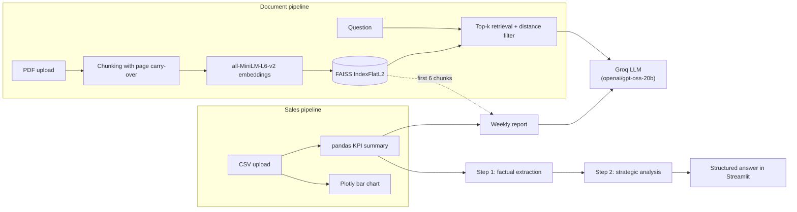

# Enterprise AI Business Assistant

A Streamlit app that gives Product Managers fact-grounded answers from strategy documents (RAG) and turns raw sales CSVs into structured KPI analysis using a two-step LLM workflow.


**Live demo:** https://ai-business-assistant-rag.streamlit.app/

<!-- Add a screenshot or GIF here, e.g.: -->

<!--  -->

---

## What it does

| Tab                            | Purpose                                                                                                 | How                                                                   |
| ------------------------------ | ------------------------------------------------------------------------------------------------------- | --------------------------------------------------------------------- |
| 📄 **Document Knowledge Base** | Ask questions about a PDF (strategy document, quarterly report) and get answers grounded in its content | PDF → overlapping chunks → embeddings → FAISS → top-k retrieval → LLM |
| 📊 **Sales Data Analysis**     | Upload a sales CSV, get an instant chart and structured business analysis                               | pandas computes KPIs → compact summary → two-step LLM analysis        |
| 🗓️ **Agent Automation**       | Generate an executive report combining document context with actual sales metrics                       | Document context + KPI summary → LLM                                  |

Sales analysis uses two separate LLM steps:

**Step 1 — Factual extraction**

* Extracts metrics, values, trends and anomalies explicitly present in the data.
* Uses `temperature=0.0`.
* Does not perform strategic reasoning.

**Step 2 — Strategic analysis**

* Interprets the extracted metrics and proposes qualitative actions.
* Uses `temperature=0.4`.
* Is constrained to the facts and metric definitions supplied by Step 1.

---

## Highlights

* **Cross-page chunking.** Text is split into overlapping word windows, and the last 40 words of each page carry over into the next, so sentences that span a page break are not lost. Every chunk is tagged `[Source: Page N]`.

* **Distance-thresholded retrieval.** Results must fall under an L2 distance of `1.6`. If nothing qualifies, the single best hit is used as a fallback only if its distance is under `1.8`. Otherwise the app says it found nothing relevant instead of guessing.

* **Token-efficient analytics.** The raw CSV is never sent to the LLM. pandas builds a compact KPI summary containing totals and relevant breakdowns, which keeps prompts small and reduces token usage.

* **Two-step analysis.** Step 1 extracts factual information at `temperature=0.0`. Step 2 performs strategic interpretation at `temperature=0.4`. Both stages are shown in the UI.

* **Deterministic KPI calculations.** Financial metrics such as gross margin and gross margin rate are calculated in Python rather than relying on the LLM to perform the calculation.

* **Explicit metric definitions.** The application distinguishes between gross margin (€), gross margin rate (%) and gross margin per unit.

* **Flexible CSV schema.** Column names are matched case-insensitively against common synonyms (see [CSV format](#csv-format)).

* **Persistent knowledge base.** The FAISS index and chunks are saved to disk and reloaded on the next start.

---

## Architecture



---

## Tech stack

* **UI:** [Streamlit](https://streamlit.io)
* **LLM:** [Groq](https://groq.com) chat completions API, model `openai/gpt-oss-20b`
* **Embeddings:** [`sentence-transformers`](https://www.sbert.net) with `all-MiniLM-L6-v2`
* **Vector search:** [FAISS](https://github.com/facebookresearch/faiss) (`faiss-cpu`, flat L2 index)
* **PDF parsing:** `pypdf`
* **Data and charts:** `pandas`, `plotly`

---

## Getting started

### Prerequisites

* Python 3.11
* A free [Groq API key](https://console.groq.com/keys)

### Installation

```bash
git clone https://github.com/nat15hol/ai-business-assistant.git

cd ai-business-assistant

python -m venv .venv

source .venv/bin/activate
# Windows: .venv\Scripts\activate

pip install -r requirements.txt
```

> The first run downloads the embedding model (roughly 90 MB), and `sentence-transformers` pulls in PyTorch, so the install can take a few minutes.

### Configuration

The app reads the API key from the `GROQ_API_KEY` environment variable.

**Option A: environment variable**

```bash
export GROQ_API_KEY="your-key-here"

# Windows PowerShell:
$env:GROQ_API_KEY="your-key-here"
```

**Option B: Streamlit secrets**

Create `.streamlit/secrets.toml`:

```toml
GROQ_API_KEY = "your-key-here"
```

Streamlit exposes top-level secrets as environment variables, so this works without code changes.

### Run

```bash
streamlit run app.py
```

Open `http://localhost:8501`.

### GitHub Codespaces / Dev Container

The repo ships with a `.devcontainer` using Python 3.11. Open it in Codespaces or VS Code Dev Containers and dependencies install automatically.

Add `GROQ_API_KEY` as a Codespaces secret beforehand so the app can reach the LLM.

---

## Usage

### 1. Ask questions about a document

1. Open **📄 Document Knowledge Base** and upload a PDF.
2. Wait for the **"Document successfully indexed"** message.
3. Ask a question, for example:

> "What are our stated priorities for next quarter?"

The PDF must contain selectable text. Scanned or image-only PDFs are rejected because the application does not currently perform OCR.

### 2. Analyse sales data

1. Open **📊 Sales Data Analysis** and upload a CSV.
2. Review the preview and generated revenue chart.
3. Choose **Run Standard Data Analysis** for a single-pass analysis, or **Run Multi-Step Agentic Analysis** to see factual extraction followed by strategic analysis.

### 3. Generate the combined report

Open **🗓️ Agent Automation** and click **Generate Final Weekly Report**.

The workflow can operate with a PDF, a CSV, or both. Results are most useful when both are loaded.

---

## CSV format

Columns are detected automatically. The first matching recognised column is used.

| Role                    | Recognised column names                                         |
| ----------------------- | --------------------------------------------------------------- |
| Time axis (chart)       | `Month`, `quarter`, `Quarter`, `Date`, `period`                 |
| Revenue (chart)         | `Revenue`, `revenue_eur`, `revenue`, `Sales`                    |
| Colour grouping (chart) | `Product`, `product`, `segment`, `Segment`                      |
| Gross margin (KPIs)     | `gross_margin_eur`, `Margin`, `margin`                          |
| Units (KPIs)            | `units_sold`, `Units`, `units`, `quantity`                      |
| Breakdowns (KPIs)       | `quarter` / `Month` / `period`, `product`, `segment`, `country` |

A time column and a revenue column are required for the chart. The KPI summary uses whichever recognised metrics are available.

Example:

```csv
quarter,product,segment,country,revenue_eur,gross_margin_eur,units_sold
2025-Q1,Alpha,Enterprise,SE,125000,52000,310
2025-Q1,Beta,SMB,DE,48000,17500,420
2025-Q2,Alpha,Enterprise,SE,139000,58000,342
```

---

## Project structure

```text
ai-business-assistant/

├── app.py                  # Entire application: UI, RAG, analytics and agent logic
├── requirements.txt        # Python dependencies
├── .devcontainer/
│   └── devcontainer.json   # Codespaces / VS Code Dev Container setup
└── .gitignore              # Excludes secrets and generated index files
```

Generated at runtime and git-ignored:

* `faiss_index.bin`
* `chunks.pkl`

---

## Tuning

Key parameters live in `app.py`:

| Setting                  | Default              | Effect                                               |
| ------------------------ | -------------------- | ---------------------------------------------------- |
| `MAX_DISTANCE`           | `1.6`                | Maximum L2 distance for a chunk to count as relevant |
| `chunk_size` / `overlap` | `80` / `20` words    | Chunk length and local overlap                       |
| `page_overlap_words`     | `40`                 | Words carried from one page into the next            |
| `retrieve(..., k=3)`     | `3`                  | Number of chunks retrieved                           |
| `model`                  | `openai/gpt-oss-20b` | Groq chat model used by the application              |

The application uses a dedicated system prompt for factual extraction (`STEP1_SYSTEM_PROMPT`), while `BUSINESS_SYSTEM_PROMPT` is used for strategic analysis as well as general Q&A and standard analysis.

---

## Privacy and security notes

* **Data leaves your machine.** Retrieved document chunks and CSV KPI summaries are sent to the Groq API. Do not upload confidential material unless that is acceptable under your data policy.
* **Never commit your API key.** Use environment variables or Streamlit secrets.
* **`chunks.pkl` is loaded with `pickle`.** Only run the app against index files generated by the application itself, since unpickling untrusted files can execute arbitrary code.

---

## Known limitations

* Only one document is indexed at a time. Uploading a new PDF overwrites the previous index on disk.
* The saved index is global to the running instance, so on a shared deployment all users see the same knowledge base.
* The weekly report uses the **first six chunks** of the document rather than query-relevant chunks, so it primarily reflects the beginning of the PDF.
* Source page numbers are included in the LLM context but are not yet displayed as citations in the UI.
* **Step 2 grounding.** The Multi-Step agent can still introduce plausible but ungrounded reasoning, such as speculating about causes behind a trend or suggesting business actions not supported by the underlying data. Prompt constraints reduce this behaviour but cannot fully eliminate free-text reasoning drift.
* Groq's free tier enforces a tokens-per-minute (TPM) limit. The KPI-summary approach keeps requests relatively small, but frequent use can still occasionally hit a rate limit.
* `requirements.txt` is unpinned, so future library releases may change behaviour.

---

## Roadmap ideas

* [ ] Show cited source pages next to each answer
* [ ] Ground Step 2 recommendations with explicit references to the Step 1 metrics they are based on, with programmatic validation
* [ ] Multi-document support with per-document filtering
* [ ] OCR for scanned PDFs
* [ ] Pin dependency versions
* [ ] Per-session indexes instead of a shared on-disk index
* [ ] Unit tests for chunking, retrieval and KPI summary logic

---

## Author

**Henrik Oldehed**

Data Engineer | Backend and Software Developer — building full-stack systems end-to-end

GitHub: https://github.com/nat15hol

LinkedIn: https://www.linkedin.com/in/henrikoldehed/

---

## License

[MIT](LICENSE)
